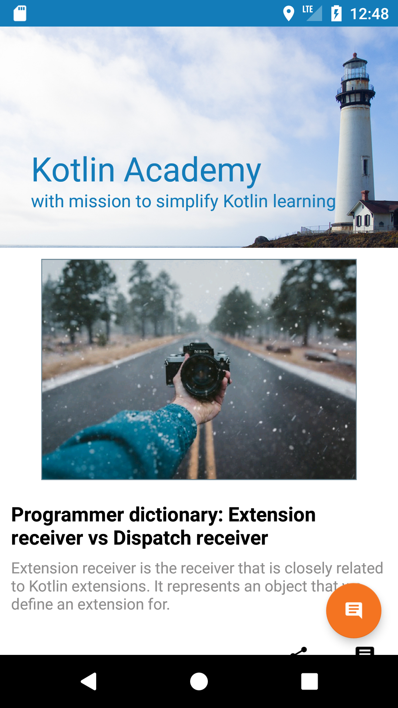
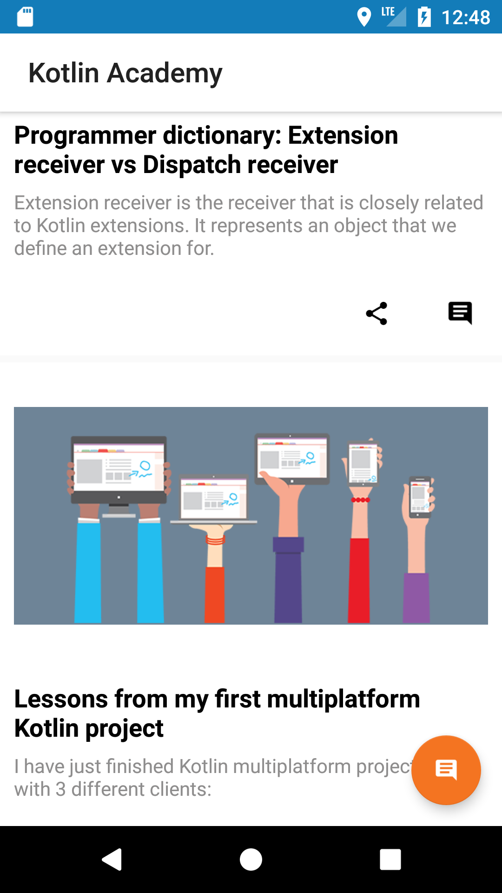
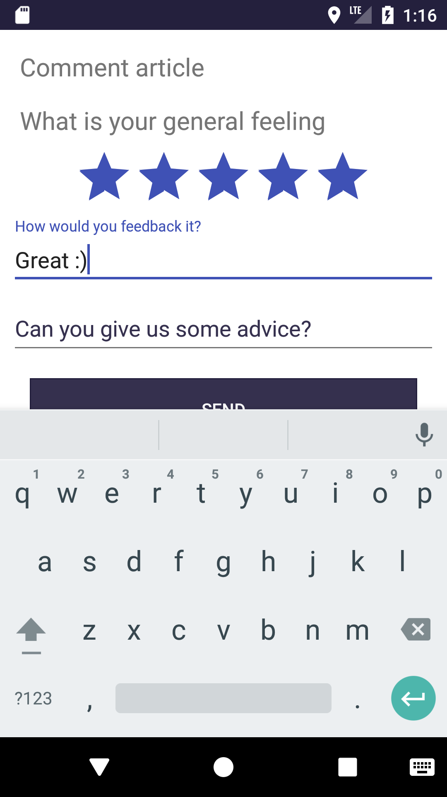
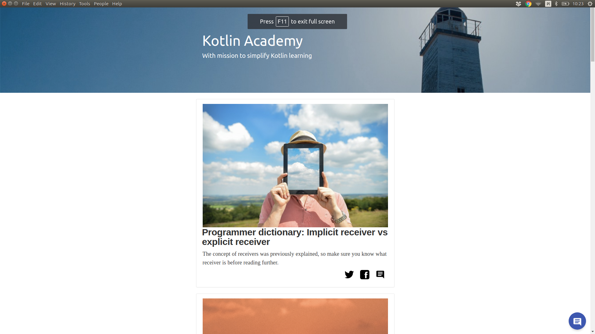
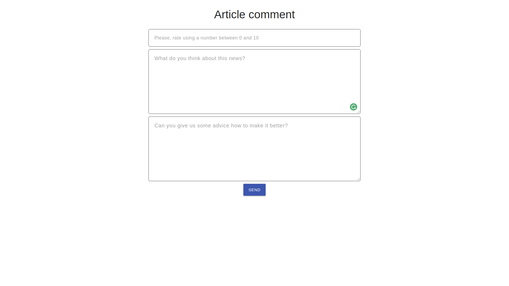
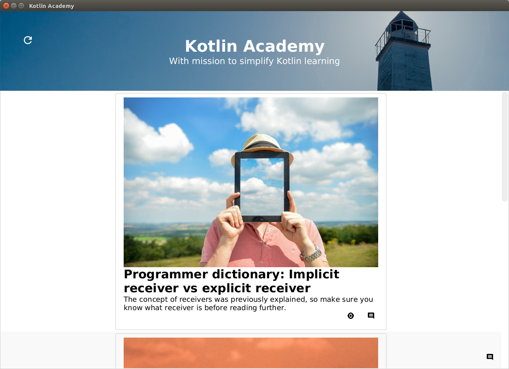
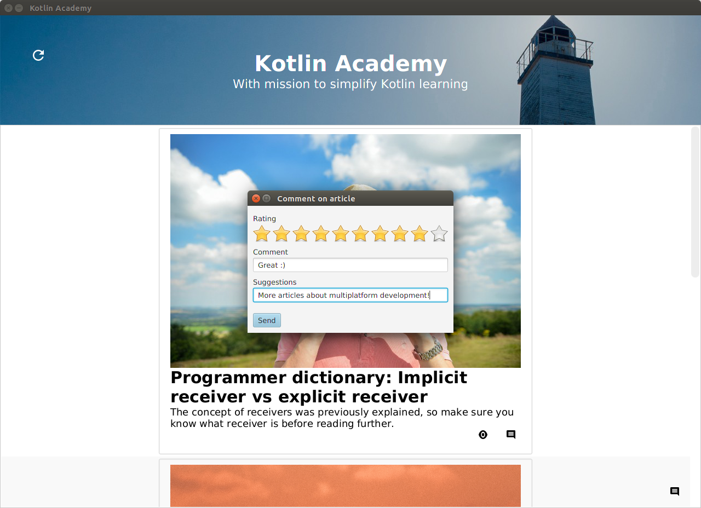

# KotlinAcademy application

This is an example how multiplatform development can be used to effectively extrac and reuse logic. 
It contains multiple clients that implement the same logic and single backend.
The only common part for all this project is Data Model, so it is placed in `common` module which is shared among all the platforms.
All client applications are based on MVP (Model-View-Presenter). 
Presenters are common for all of them and they are placed in `common-client` module. 
It contains all business logic and is well tested.
Views are implemented separately for every platform. 
Presenters are using Data Model, and communicating with Views from behind the interfaces that are placed in `common-client` module.
On the other side Presenters are communicating with repositories (network API, databases etc.) 
which are hidden behind an interfaces (for unit-testing purposes) and specified as an expected declarations
which have actial declaration in platform modules (`common-client-jvm` and `common-client-js`).

Application is composing Kotlin [Kotlin Academy](https://blog.kotlin-academy.com/) and presenting them together. 
It also allows giving the feedback this news or to Kotlin Academy. 

Here is the status of planned clients:
* Android - DONE
* Web - DONE ([Demo](https://kotlin-academy.herokuapp.com/))
* Desktop - DONE
* Android Wear - Started
* Firefox plugin - Not yet started
* Chrome plugin - Not yet started
* iOS - Not yet started

We will really appreciate help in any of this areas. 

## Backend

It is providing following methods:
* GET /news - returns list of news.
* POST /feedback - used to send feedback about an article.

To run desktop application, just excecute in the root folder of the project:

```
./gradlew :backend:run
```

## Android

Android client is used to display list of news. It uses common-client logic to display loading, refreshing and obtaining list of elements. Here are some screens:

See the [usage video](https://youtu.be/PaxxtSLHH38).

  

If you open project in Android Studio, it will find both Android mobile and Android watch projects. This way you can easily run the projects. 

Backend URL depend on build type. Application run in debug mode will use `localhost` as base URL so it will not work unless you run backend first. Applicatin run in release mode is production backend as a API base URL. 

If you don't have Android SDL and you don't want to work on Android module then you can change `gradle.properties` property `INCLUDE_ANDROID` to `false`. Alternatively you can add `-Dorg.gradle.project.INCLUDE_ANDROID=false` to your gradle build task. 

## Web

Web client with the same logic like Android app. It is implemented in React.

Demo is [here on Heroku](https://kotlin-academy.herokuapp.com/#/).

 

To run web, you should use following commands:
```
cd web
gradle build
npm run serve
```

## Desktop

Desktop [TornadoFX](https://github.com/edvin/tornadofx) client.
Designed by [Edvin Syse](https://twitter.com/edvinsyse), creator of TornadoFX.
Still during designing process.

 

To run desktop application, just excecute in the root folder of the project:

```
./gradlew :desktop:run
```

Warning: It is not working with OpenJDK because it doesn't include JavaFX by default. You need to use Oracle JDK.

## Tests

Business logic, especially while it is shared among all the platforms, is unit-tested.
Tests are universal, but they are now located [in Android module](https://github.com/MarcinMoskala/KotlinAcademyApp/tree/master/android/mobile/src/test/java/org/kotlinacademy).
They should be moved to common-client module.

To run unit tests, [here](https://developer.android.com/training/testing/unit-testing/local-unit-tests.html#run) are instructions for Android Studio and Idea IntelliJ. To run them using Gradle, juse:

```
./gradlew test
```

## Heroku

To push on heroku, you need to specify following GRADLE_TASK:

```
heroku config:set GRADLE_TASK="-Dorg.gradle.project.INCLUDE_ANDROID=false :web:build :web:buildBundle copyWeb :backend:build"
```
