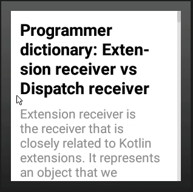
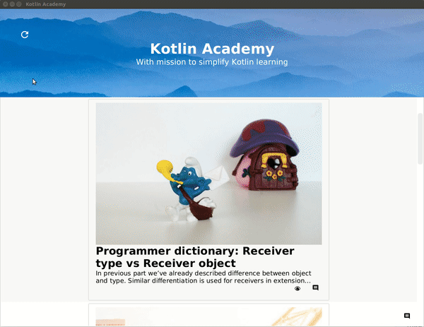

# KotlinAcademy application

[](https://travis-ci.org/MarcinMoskala/KotlinAcademyApp)
[](http://waffle.io/MarcinMoskala/KotlinAcademyApp)
[](https://codebeat.co/projects/github-com-marcinmoskala-kotlinacademyapp-master)
[](https://github.com/MarcinMoskala/PreferenceHolder)
[](https://github.com/MarcinMoskala/PreferenceHolder)

This is an example how multiplatform development can be used to effectively extract and reuse logic. 
It contains multiple clients that implement the same logic and single backend.
The only common part for all this project is Data Model, so it is placed in `common` module which is shared among all the platforms.
All client applications are based on MVP (Model-View-Presenter). 
Presenters are common for all of them and they are placed in `common-client` module. 
It contains all business logic and is well tested.
Views are implemented separately for every platform. 
Presenters are using Data Model, and communicating with Views from behind the interfaces that are placed in `common-client` module.
On the other side Presenters are communicating with repositories (network API, databases etc.) 
which are hidden behind an interfaces (for unit-testing purposes) and specified as an expected declarations
which have actial declaration in platform modules (`common-client-jvm` and `common-client-js`).

Application is composing Kotlin [Kotlin Academy](https://blog.kotlin-academy.com/) and presenting them together. 
It also allows giving the feedback this article or to Kotlin Academy.

Here is the status of planned clients:
* Android mobile - DONE ([Play](https://play.google.com/store/apps/details?id=org.kotlinacademy.mobile))
* Web - DONE ([Demo](https://kotlin-academy.herokuapp.com/))
* Desktop - DONE
* Android Wear - Needs designing
* Firefox plugin - Not yet started
* Chrome plugin - Not yet started
* iOS - Not yet started

We will really appreciate help in any of this areas. 

## Backend

To run desktop application, just excecute in the root folder of the project:

```sbtshell
./gradlew :backend:run
```

## Android

Android client is used to display list of article. It uses common-client logic to display loading, refreshing and obtaining list of elements. Here are some screens:




If you open project in Android Studio, it will find both Android mobile and Android watch projects. This way you can easily run the projects. 

Backend URL depend on build type. Application run in debug mode will use `localhost` as base URL so it will not work unless you run backend first. Applicatin run in release mode is production backend as a API base URL. 

If you don't have Android SDK and you don't want to work on Android module then you can change `gradle.properties` property `INCLUDE_ANDROID` to `false`. Alternatively you can add `-Dorg.gradle.project.INCLUDE_ANDROID=false` to your gradle build task. 

## Web

Web client with the same logic like Android app. It is implemented in React.

Demo is [here on Heroku](https://kotlin-academy.herokuapp.com/#/).


To run web, you should use following command:

```sbtshell
./gradlew :web:run
```

## Desktop

Desktop [TornadoFX](https://github.com/edvin/tornadofx) client.
Designed by [Edvin Syse](https://twitter.com/edvinsyse), creator of TornadoFX.
Still during designing process.



To run desktop application, just excecute in the root folder of the project:

```sbtshell
./gradlew :desktop:run
```

Warning: It is not working with OpenJDK because it doesn't include JavaFX by default. You need to use Oracle JDK.

## Tests

Business logic, especially while it is shared among all the platforms, is unit-tested.
Tests can be found on [common-client module](https://github.com/MarcinMoskala/KotlinAcademyApp/tree/master/common-client/src/test/kotlin/org/kotlinacademy).

Run them using following commands:

```sbtshell
./gradlew :common-client-jvm:test
./gradlew :common-client-js:test
```

## Heroku

To push on Heroku, you need to specify following GRADLE_TASK:

```sbtshell
heroku config:set GRADLE_TASK="-Dorg.gradle.project.INCLUDE_ANDROID=false serverPrepare"
```

## Contribution

A lot needs to be done in this project. The mission is to to build solid massive-multiplatform project. See [board](https://waffle.io/MarcinMoskala/KotlinAcademyApp/join) to check out how you can help us. If you want to chellange yourself and face one of this tasks then join project, assing it to yourself, move to "In progress" and start doing. Don't bother to ask if you are not sude about something. We are here to learn and help learn.

## Images sharing

All images are located in `commonImages` folder. If you want to add image to some platforms, place imege there and add this image to platform include in `imagesShare.gradle` file. Then use:

```sbtshell
./gradlew shareImages
```

To clean all the previous images (needed when you are deleting some images) use following task:

```sbtshell
./gradlew cleanImages
```

# License

Copyright 2017 Marcin Moskała

Licensed under the Apache License, Version 2.0 (the "License");
you may not use this file except in compliance with the License.
You may obtain a copy of the License at

   http://www.apache.org/licenses/LICENSE-2.0

Unless required by applicable law or agreed to in writing, software
distributed under the License is distributed on an "AS IS" BASIS,
WITHOUT WARRANTIES OR CONDITIONS OF ANY KIND, either express or implied.
See the License for the specific language governing permissions and
limitations under the License.